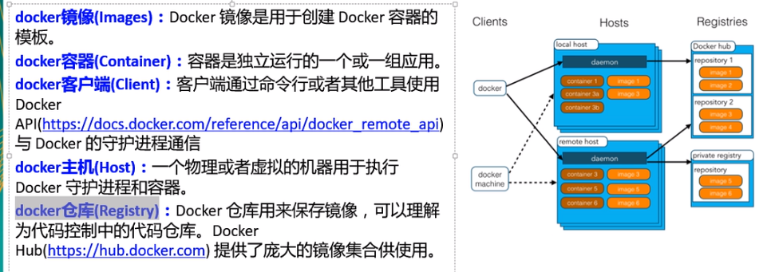
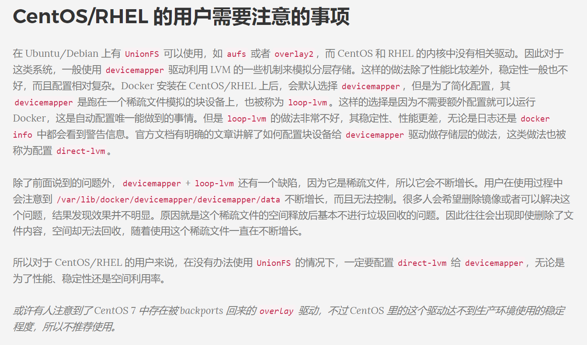
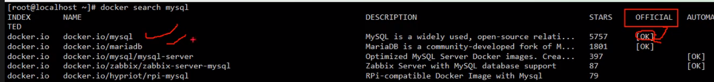
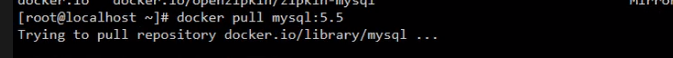
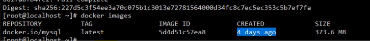
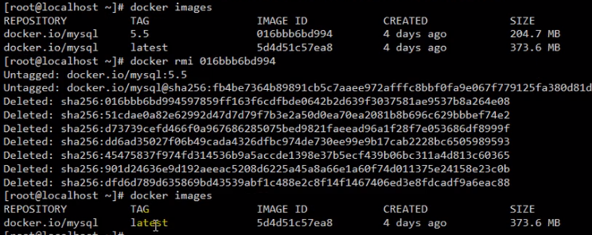
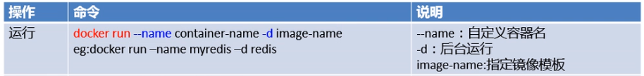
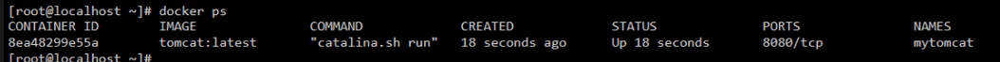
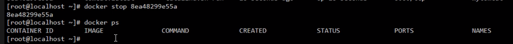

# Docker 笔记

## 一些概念




> 使用步骤： 安装docker-->安装镜像-->运行 镜像


## 安装docker

官网：https://docs.docker.com/install/linux/docker-ce/ubuntu/



## 服务启动&关闭  

启动        systemctl start docker
守护进程重启   sudo systemctl daemon-reload
重启docker服务   systemctl restart  docker
重启docker服务  sudo service docker restart
关闭docker   service docker stop   
关闭docker  systemctl stop docker


## 常用操作

### 查询hub里的镜像

```shell
docker search mysql
```



> 说明：official表示是否是官方发布，aotoma表示有没有自动配置


### 镜像操作

#### 拉取

```shell
docker pull mysql:8.0
```





> 说明：docker pull ***imageName:tag***。不写tag则拉取标签为latest的镜像

#### 查看本地仓库镜像

```shell
docker images
```

#### 删除

```shell
dicker rmi <image_id>
```

e.g.


###  容器操作

#### 启动新容器

```shell
docker run --name <container-name> -d <imange-name:tag>
```



#### 查看运行的容器列表

```
docker ps
```



> 说明： docker ps -a  查看所有容器，包括已经停止的

#### 停止容器

```
docker stop <container-id>||<name>
```



#### 启动停止的容器

```
docker start <container-id>||<name>
```

#### 查看控制台日志

```shell
#滚动查看 类似 tail -f
docker logs -f <container-id> 
```


#### 删除容器

```
docker rm <container-id>
```

> 说明：停止的容器才能删除

```shell
docker rm -f <container-id>
```

> 强制删除容器，即使容器正在运行


#### 端口映射

```shell
docker run --name <container-name> -d -p 8888:8080 <imange-name:tag>
```

> **说明：-p 8888:8080 表示将宿主机的8888端口映射到镜像的8080端口**

#### 查看日志

```
docker logs <container-id>
```

#### 以交互方式进入驱动的容器

```shell
docker exec -it <container-name>|<container-id> bash
```

#### 容器与主机之间数据拷贝

```shell
#容器数据拷贝到主机
docker cp <container-name|id>:<container-filepath> /host-path/
如：docker cp mysql:/etc/mysql .

#主机数据拷贝到容器
docker cp /host-path/ <container-name|id>:<container-filepath> 
如：docker cp /var/local/mysql mysql:/etc/mysql 
```


##  数据卷

 作用：绕过ufs存储，直接操作host存储。实现数据持久存储和共用

命令：

```shell
docker run -v /host-path/:/container-path/ <container-name>
```

### 查看所有数据卷

```
docker volume ls
```

### 删除指定数据卷

```
docker volume rm [volume_name]
```

### 删除所有未关联的数据卷

```
docker volume rm $(docker volume ls -qf dangling=true)
```


