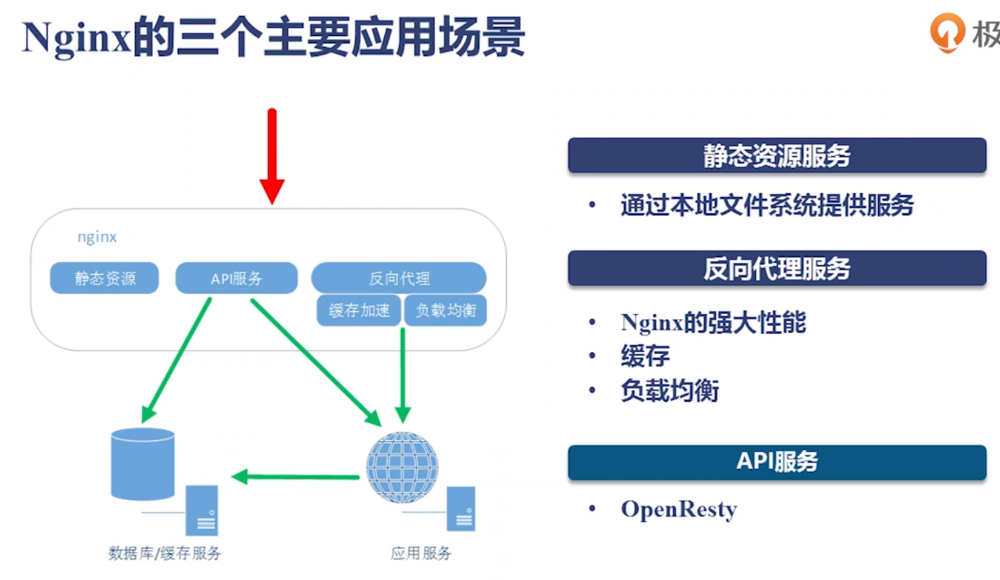
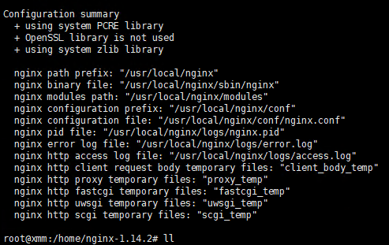

# Nginx

## 简介

*Nginx* (engine x) 是一个高性能的HTTP和反向代理服务





## 安装

### 1、通过yum或apt-get安装

### 2、源码编译安装

#### 下载解压

[官网](http://nginx.org) 下载`Stable version`版本。

```shell
wget http://nginx.org/download/nginx-1.14.2.tar.gz
```

解压

```shell
tar -zxvf nginx-1.14.2.tar.gz
```

添加vim关于nginx.conf配置文件的语法提示


```shell
cp -r  ./nginx-1.14.2/contrib/vim/*  ~/.vim/
```

#### 安装依赖

```shell
apt-get install build-essential
apt-get install libtool
apt-get install libpcre3 libpcre3-dev
apt-get install zlib1g-dev
apt-get install openssl libssl-dev 
```

#### 编译

进入nginx根目录

```shell
./configure --prefix=/usr/local/nginx
```

成功



执行make编译

```shell
make
```

```shell
make install
```

### 3、配置文件解析

四大模块

http；server；location；upstream

upstream：上游服务，如后端的tomcat服务

server ：对应一个或一组域名

location：一个URL表达式


### 4、Nginx指令


