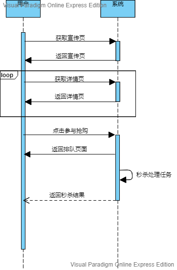

# 关于抢购秒杀促销的一些想法

**写作时间：2019年5月16日 18:05:41**

## 前言

今天面试官提了个秒杀系统设计的问题，我答得不咋地。现在难得有空，于是参考网络上大牛们的方案，仔细思考并整理下自己的想法和思考。**思虑欠妥之处，欢迎指正！**

## 业务场景简介

抢购：一段时间内允许用户以一定的价格购买一定数量的商品。如10:00至11:00点1000提牛奶8折购，每人限买2提。

秒杀：极短的时间内（一秒？）允许用户以一定的价格（往往极低）购买数量极少的产品。如9:00点开始，10提牛奶1折购，每人限买一提。

促销：较长时间段内允许用户以一定价格购买大量产品。如开业庆典搞三天，全部商品8折买。

>  注意：上面这些其实都是促销活动。促销含义很广，不单针对实物商品也可以针对虚拟商品，比如服务，卡券，某种资格或凭证等。而且促销也不一定发生在交易活动中。本文的促销特指上文这种某种条件下的交易活动。

那么总结一下，抢购秒杀促销就是指**在短时间内大量用户向提供少量商品售卖服务的系统发起了大量请求以占有少量商品的行为。** 这个请求数量之大往往远超系统服务的承载能力，而同时，商品又有多种购买限制，导致购买行为需要某种限制和协调。本文就是针对如何解决这个问题（简称**抢购问题**，下同）的探讨。

## 分析和解读

抢购问题可以概括为：短期内大量个体针对少量资源的争夺。站在系统设计层面，`短期`指一段时间以内允许操作，过期则不允许；`大量个体`是指用户往往会很多，其发出的请求也会很多，可能远超系统承载能力；`少量资源`有两方面，一指待售的商品数量少，二指系统服务资源有限；`争夺`指少量的人成功，大量的人失败。

那么，应对抢购问题，我觉得应从几个方向入手：

- 应对高并发

  > 抢购请求往往时间集中且数量远远超过服务器的承载范围，如何保证服务不瘫痪，不影响其他服务。

- 商品不超售

  > 解决这个问题往往会造成效率降低

- 反作弊

  > 防止用户通过种种手段绕过购买限制
- 高效率

  > 这个问题其实是一个综合问题，需要和上面的三个问题一起综合考量

- 用户友好

  > 如何及时返回用户可接受的结果，让他们觉得平台是高效的且没有弊。这个问题很关键嗷~，搞不好就成了花钱挨骂哟。

可以说，一个平台能保证系统服务在抢购期总体可用，商品不超售，短期难作弊，服务响应准确及时友好。那么就可以宣称系统可以承载抢购活动。

啰嗦一大堆，目的是描述清楚问题，如果连问题描述都不清楚那就别谈怎么解决它。

## 解决方法的思考

假设服务为五层架构:

- 前端层：html+移动端native+js
- 网关路由层：Nginx or OpenResty
- 业务层：Restfull接口，Http，无状态集群服务
- 缓存层：redis
- 存储层：DB

下面探讨下问题解决思路。

我们来梳理下抢购的处理过程。

首先，用户在宣传页看到促销商品，然后用户点击链接进入商品详情页，此时详情页有进入秒杀的按钮，没到时间按钮不可用，用户可能反复刷新详情页。到时间后按钮可用，用户点击进入秒杀，出现秒杀排队页面显示一些信息，一段时间后服务端通知抢购结果，抢购成功则引导进入下单支付，不成功仅仅显示结果。时序图表示：

### 应对高并发

应对高并发最粗暴最直接的办法就是加机器加带宽。是不是很多人反对？别急，我在这里提出这个搞法不是说直接堆硬件了事，而是想说解决这个问题需要提供一定的硬件资源基础，该堆资源就要堆资源。你不能说平时运行10台服务器满足要求，大促的时候还特么只搞这10台扛，非要这么搞那也只能牺牲其他业务了。总的来说，大促抢购时最好能根据预估的并发数量对硬件资源做下扩容，哪怕是临时的也好。现在不是各种云平台各种容器啦自动编排啦，上就完了。

另一种应对高并发的方案就是缓存。但仔细想想，对于读请求，缓存能大幅减少服务压力。可对于写服务呢，貌似有缓存还会导致缓存一致性的问题。然而缓存确实是必要的，上面图示过程中，宣传页，详情页，排队页这些个页面内容和资源（如图片，js，css，商品信息等）都是不变的，大可以放在缓存中以减少抢购期服务器压力。这个缓存的具体方案有如下几种：浏览器缓存[^1]，CDN，Nginx缓存[^2]，可以结合使用。这样，一部分大促前一段时间的访问请求就能挡在系统外，尤其是对详情页的访问请求。

### 商品不超售

### 反作弊

### 高效率

### 用户友好

## 参考和引用

[^1]: web性能优化:详说浏览器缓存  <https://www.cnblogs.com/etoah/p/5579622.html>
[^2]: 张开涛：亿级流量网站架构核心技术 <https://book.douban.com/subject/26999243/>