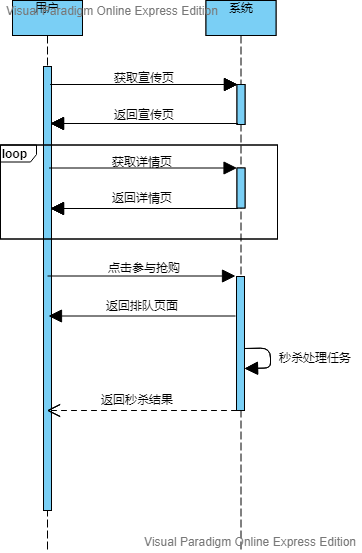

# 关于高并发下抢购秒杀促销的一些想法

**写作时间：2019年5月16日 18:05:41**

## 前言

今天面试官提了个秒杀系统设计的问题，我答得不咋地。现在难得有空，于是参考网络上大牛们的方案，仔细思考并整理下自己的想法和思考。**思虑欠妥之处，欢迎指正！**

## 业务场景简介

抢购：一段时间内允许用户以一定的价格购买一定数量的商品。如10:00至11:00点1000提牛奶8折购，每人限买2提。

秒杀：极短的时间内（一秒？）允许用户以一定的价格（往往极低）购买数量极少的产品。如9:00点开始，10提牛奶1折购，每人限买一提。

促销：较长时间段内允许用户以一定价格购买大量产品。如开业庆典搞三天，全部商品8折买。

>  注意：上面这些其实都是促销活动。促销含义很广，不单针对实物商品也可以针对虚拟商品，比如服务，卡券，某种资格或凭证等。而且促销也不一定发生在交易活动中。本文的促销特指上文这种某种条件下的交易活动。

那么总结一下，抢购秒杀促销就是指**在短时间内大量用户向提供少量商品售卖服务的系统发起了大量请求以占有少量商品的行为。** 这个请求数量之大往往远超系统服务的承载能力，而同时，商品又有多种购买限制，导致购买行为需要某种限制和协调。本文就是针对如何解决这个问题（简称**抢购问题**，下同）的探讨。

## 分析和解读

抢购问题可以概括为：短期内大量个体针对少量资源的争夺。站在系统设计层面，`短期`指一段时间以内允许操作，过期则不允许；`大量个体`是指用户往往会很多，其发出的请求也会很多，可能远超系统承载能力；`少量资源`有两方面，一指待售的商品数量少，二指系统服务资源有限；`争夺`指少量的人成功，大量的人失败。

那么，应对抢购问题，我觉得应从几个方向入手：

- 应对高并发

  > 抢购请求往往时间集中且数量远远超过服务器的承载范围，如何保证服务不瘫痪，不影响其他服务。

- 商品不超售

  > 解决这个问题往往会造成效率降低

- 反作弊

  > 防止用户通过种种手段绕过购买限制
- 高效率

  > 这个问题其实是一个综合问题，需要和上面的三个问题一起综合考量

- 用户友好

  > 如何及时返回用户可接受的结果，让他们觉得平台是高效的且没有弊。这个问题很关键嗷~，搞不好就成了花钱挨骂哟。

可以说，一个平台能保证系统服务在抢购期总体可用，商品不超售，短期难作弊，服务响应准确及时友好。那么就可以宣称系统可以承载抢购活动。

啰嗦一大堆，目的是描述清楚问题，如果连问题描述都不清楚那就别谈怎么解决它。

## 解决方法的思考

假设服务为五层架构:

- 前端层：html+移动端native+js
- 网关路由层：Nginx or OpenResty
- 业务层：Restfull接口，Http，无状态集群服务
- 缓存层：redis
- 存储层：DB

下面探讨下问题解决思路。

我们来梳理下抢购的处理过程。

首先，用户在宣传页看到促销商品，然后用户点击链接进入商品详情页，此时详情页有进入秒杀的按钮，没到时间按钮不可用，用户可能反复刷新详情页。到时间后按钮可用，用户点击进入秒杀，出现秒杀排队页面显示一些信息，一段时间后服务端通知抢购结果，抢购成功则引导进入下单支付，不成功仅仅显示结果。时序图表示：

### 应对高并发

应对高并发最粗暴最直接的办法就是加机器加带宽。有人反对？别急，我在这里提出这个搞法不是说直接堆硬件了事，而是想说解决这个问题需要提供一定的硬件资源基础，该堆资源就要堆资源。你不能说平时运行10台服务器满足要求，大促的时候还特么只搞这10台扛，非要这么搞那也只能牺牲其他业务了。总的来说，大促抢购时最好能根据预估的并发数量对硬件资源做下扩容，哪怕是临时的也好。现在不是各种公有云私有云混合云 ，各种容器啦自动编排啦，上就完了。

另一种应对高并发的利器就是缓存。但仔细想想，对于读请求，缓存能大幅减少服务压力。可对于写请求呢，貌似有缓存还会导致缓存一致性的问题。然而缓存确实是必要的，上面图示过程中，宣传页，详情页，排队页这些个页面内容和资源（如图片，js，css，商品信息等）都是不变的，大可以放在缓存中以减少抢购期服务器压力。这个缓存的具体方案有如下几种：浏览器缓存[^1]，CDN，Nginx缓存[^2]，可以结合使用。这样，一部分大促前一段时间的访问请求就能挡在系统外，尤其是对详情页的访问请求。

下面就是如何应对抢购请求的高并发问题了。我们来捋一捋场景：用户在刷着页面（或者局部刷新），时间渐渐抵达抢购开始时间（此时一直和服务端交互），页面根据服务端返回值决定是否打开抢购按钮，若没有打开则做友好提示；若打开了，用户点击抢购按钮，页面做一些判断并组装请求数据，而后发送请求到服务端。服务端收到请求返回或不返回，页面跳转到等待页（或不跳转原地等待），服务端返回抢购结果。

简单的讲分为三步：

- 详情页请求服务端，并及时打开抢购入口
- 用户提交抢购请求
- 服务端接收请求，同步或异步返回抢购结果

这三个环节都有高并发和海量请求的压力。而且仔细分析可以发现这些请求大多不能利用缓存阻挡，它们必须被及时发送给服务器处理，并且服务器最好能及时给予处理结果。如何处理这些问题，下面是我的一些想法。

#### 详情页处理

这一环节一般用户会频繁刷新详情页，我们可以**把对页面资源的请求和抢购开始请求分开做**，即有一个专门的接口来判断是否开始抢购。**因为页面资源是几乎不会变化的，可以放到缓存里**，用户渲染完页面后，再发请求判断是否开始抢购。这样我们把这个环节设计成了：页面缓存+抢购开始请求接口（简称`申请接口`）两部分。页面缓存用来减少客户端与服务端的数据传输也可以阻挡一部分请求抵达服务端。但是申请接口依然存在高并发问题。那么申请接口要如何做呢？

我们分析一下，用户不断发起接口请求从而产生并发压力，一般这个请求的触发有两种方式，页面加载完成被动触发或页面按钮点击主动触发。而不管用户如何发起，这些请求大部分都是无用的，为什么？想一想，一秒钟发10次请求和一秒钟发100次请求区别到底有多大？而且用户关心的其实并不是这个接口响应有多快，用户在意的是能不能及时通知抢购开始！用户不断的请求只是本能的反应，他们本能的认为请求多一点就能及时得到结果，而实际结果却恰恰相反！那么我们就有了解决思路：用各种手段**降低这个接口的请求频率**。具体有如下方法，

- 页面控制

  > 被动触发改为页面加载完成后3秒或5秒或更长再触发申请接口，这样频繁刷新页面就不会产生过量请求。
  >
  > 主动触发按钮加上UI限制，让用户不能连续点击。

- 接入层网关控制

  > 页面控制只能防止“文明用户”的过量请求。不文明的用户请求需要网关来控制。如何做，可以通过Nginx限流模块来限制请求速率和连接总数量[^3]；也可以通过缓存解决，因为接口返值只在某一个具体时刻才改变，典型的读多写少嘛。具体操作如下：先初始化缓存放入默认值，**网关接到接口请求后直接把缓存里的值返回**客户端，后端服务启动定时任务，抢购开始前一刻，修改缓存即可。

- 后端处理

  > 如果觉得不想在网关做太多业务，可以放在后端做。网关做限流，请求发送到后端服务，服务自己维护缓存即可，也可以结合浏览器缓存[^1]来做。但网关限流是必须要做的。

关于这个申请接口还有一些东西需要注意，一般不能采用简单的接口返回某个特定值给页面，然后页面控制是否打开按钮来完成，因为这样很容易被破解。而且抢购地址和商品信息等最好不要在前端提前暴露，防止被人利用。那么这个申请接口可以这样做，这个接口不仅仅返回状态值，还返回抢购请求地址。页面拿到结果后UI控制抢购按钮打开，用户点击抢购实际访问的就是这个抢购地址来进行抢购。总之就是千方百计防止有人提前拿到抢购请求信息。

#### 抢购请求处理

先明确场景：用户拿到了抢购资格，点击按钮发起抢购。一般地，服务器收到请求后应该快速处理然后返回用户抢购结果。如果失败，流程结束。如果成功，引导用户去下单支付。如果用户量比较小，业务简单，可以把抢购和下单放在一起处理，这样抢购成功即使下单成功，用户补充一些信息后直接支付即可。如果用户量大，业务复杂流程长，也可以把抢购和下单分开，抢购成功仅仅表示占有库存且有下单资格，后续还需要下单支付。具体如何操作各自根据自身特点考虑。

用户发出抢购请求给服务端后，服务端有两种响应方式，同步的；异步的。同步效果如下：用户请求提交后，页面一直等待直到超时或服务端处理完成返回结果。异步效果：用户提交请求后，页面直接拿到返值，服务端处理完成，页面收到通知展示结果。看上去没啥区别对吧，其实在页面确实可以做到看上去没有差别，但是其实还是有差别的。同步请求有些问题，一是必须持有链接，不管是form提交也好还是ajax访问也好，页面不能刷新或关闭，不然结果收不到；再一个就是超时。也即页面不能一直等着服务端给结果，而服务端一般也不会一直维持一个不活动的链接。所以同步模式下，必须考虑超时的处理和额外提供一个查询抢购结果的方法，不然用户收不到结果。而且同步模式**可能**不能承载较大并发请求。

> 上面说的同步异步是对业务交互形式的描述，不是网络编程里的同步异步，这里和网络编程没关系，别搞混。因为我暂时没找到好的方法描述，所以用同步异步形容。

因此建议大家把这块儿做成异步的，即用户提交抢购请求后，服务端收到请求后放入MQ，然后返回，页面收到结果后进入排队页。这样做好处是能够提高服务端的吞吐量，降低响应时间，同时不需要页面一直等待。那服务端的处理结果怎么获取呢？两个方案，页面ajax轮训或者服务端主动推送。

### 商品不超售

### 反作弊

### 高效率

### 用户友好

## 参考和引用

[^1]: web性能优化:详说浏览器缓存  <https://www.cnblogs.com/etoah/p/5579622.html>
[^2]: 张开涛：亿级流量网站架构核心技术：Nginx缓存章节 <https://book.douban.com/subject/26999243/>
[^3]: 张开涛：亿级流量网站架构核心技术：Nginx限流章节 <https://book.douban.com/subject/26999243/